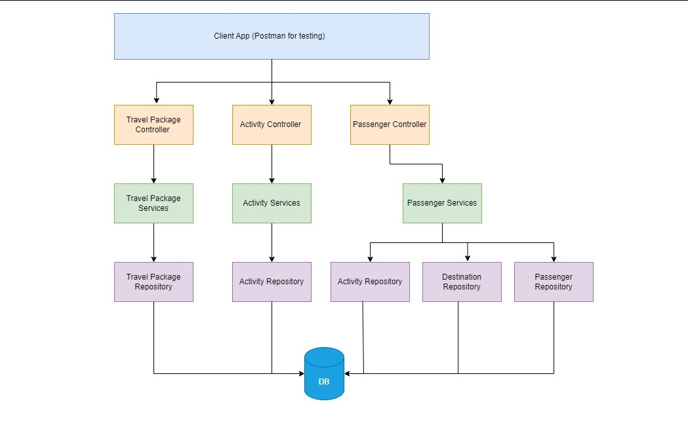
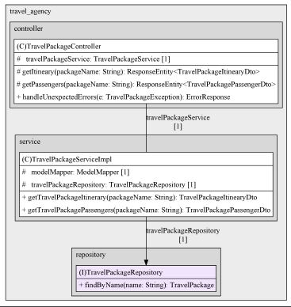
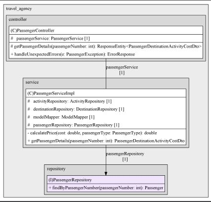

# **Travel Agency Management System**
This project implements a software system for travel agencies to maintain their travel packages' itinerary and passengers.

## Specifications
- Travel packages contain information such as name, passenger capacity, itinerary, and list of passengers.
- Each destination in the itinerary includes a name and a list of available activities.
- Activities have attributes like name, description, cost, and capacity, and are associated with a specific destination.
- Passengers can sign up for activities at each destination.
- Passenger types include standard, gold, and premium, each with unique characteristics regarding activity sign-up and payment.

## Project Structure
The project structure includes the following main components:
- src/: Source code directory containing Java classes.
- test/: Directory for unit tests.
- README.md: README file with project information and instructions.
- Other directories and files as necessary.

## Setup
To set up the project, follow these steps:
- Clone the repository from GitHub.
- Open the project in your preferred Java IDE.
- Ensure you have Java and Maven installed on your system.
- Resolve any dependencies specified in the pom.xml file.

# **HLD Diagram**

# **UML for classes**
 

